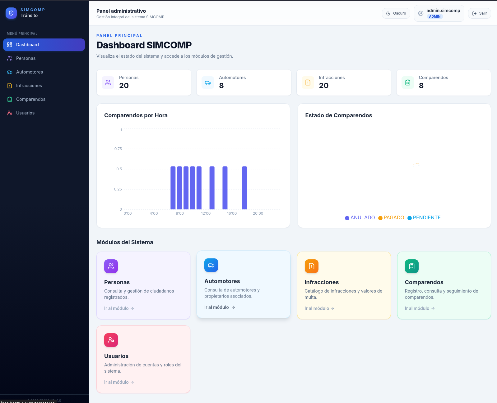
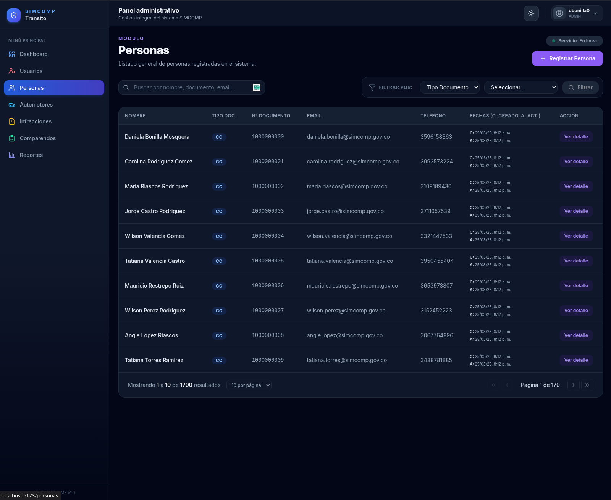
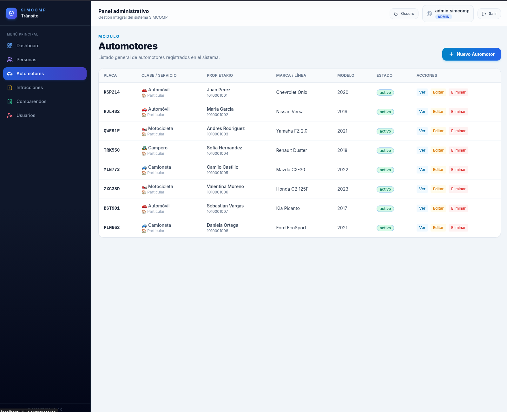
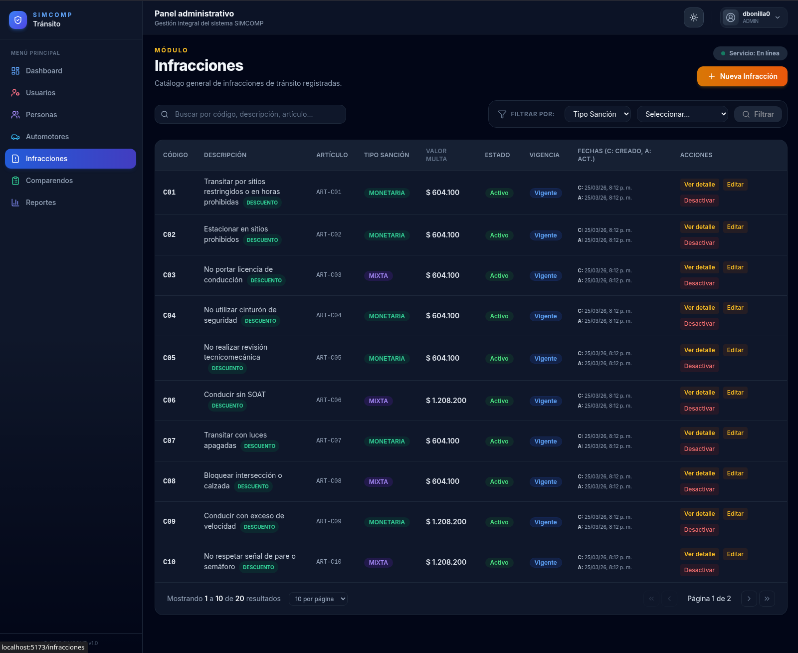
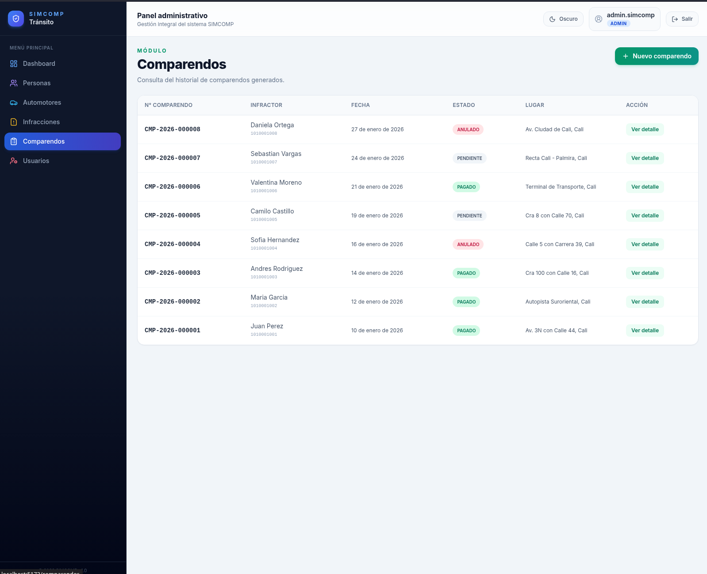
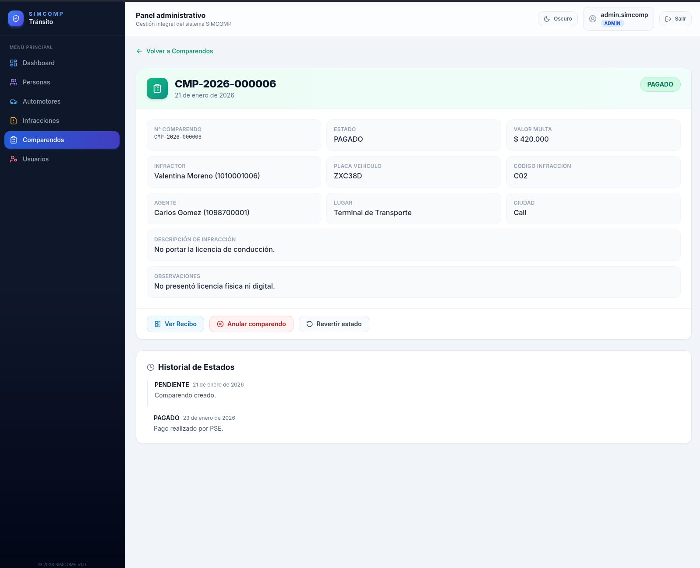
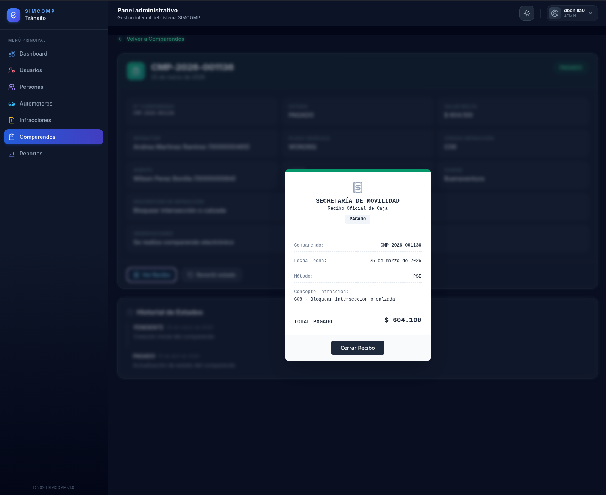
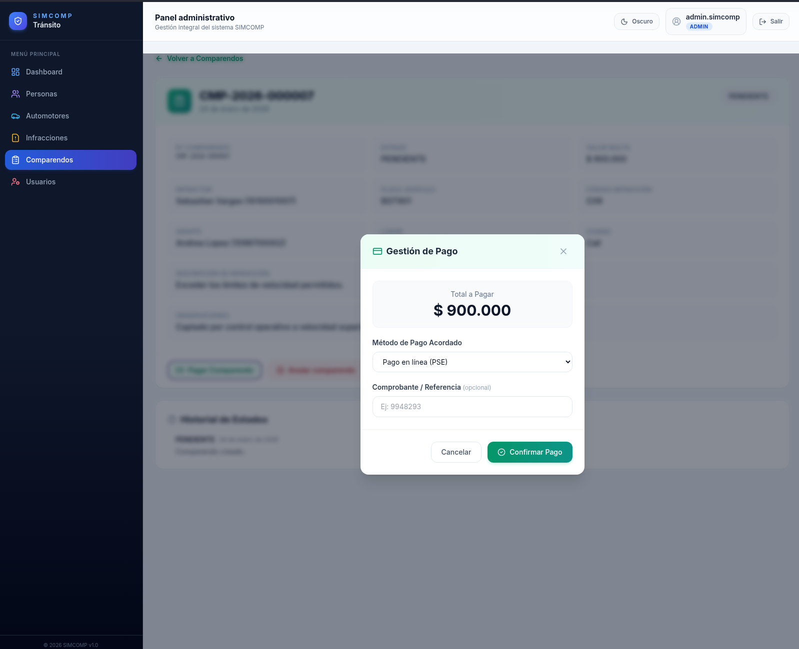
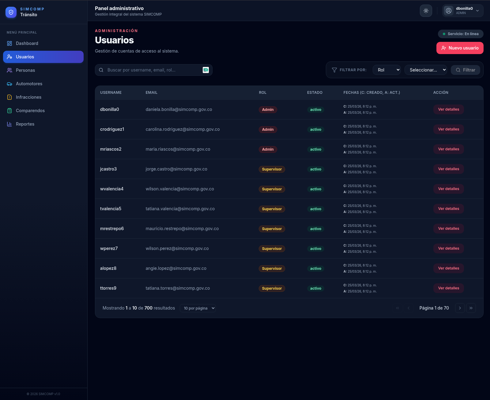

# SIMCOMP — Despliegue en Vagrant

Guía para desplegar en **3 VMs** con Vagrant + Ansible. Sin Docker en producción.

---

# Imagenes Módulos SIMCOMP

- login


- dashboard


- personas


- automotores


- infracciones


- comparendos


- detalles-comparendo


- recibo-comparendo


- paga-comparendo


- usuarios



-## Arquitectura (Red 192.168.100.x)

```
Tu navegador → 192.168.100.4 (Nginx / Frontend)

srv-simcomp-dns  192.168.100.2   BIND9 — zona simcomp.co
srv-simcomp-api  192.168.100.3   5 microservicios + PostgreSQL + PM2 (Puertos 800x / 543x)
srv-simcomp-web  192.168.100.4   Nginx API Gateway + React SPA (Puertos 80 / 800x)

Servicios en srv-simcomp-api (192.168.100.3):
  auth-service         :8001  →  usuarios_db     (puerto 5432)
  personas-service     :8002  →  personas_db     (puerto 5433)
  automotores-service  :8003  →  vehiculos_db    (puerto 5434)
  infracciones-service :8004  →  infracciones_db (puerto 5435)
  comparendos-service  :8005  →  comparendos_db  (puerto 5436)

Gateways en srv-simcomp-web (192.168.100.4):
  Port 80            → React SPA (Frontend principal)
  :8001 (Gateway)    → srv-simcomp-api:8001 (Auth)
  :8002 (Gateway)    → srv-simcomp-api:8002 (Personas + JWT)
  :8003 (Gateway)    → srv-simcomp-api:8003 (Automotores + JWT)
  :8004 (Gateway)    → srv-simcomp-api:8004 (Infracciones + JWT)
  :8005 (Gateway)    → srv-simcomp-api:8005 (Comparendos + JWT)
```

---

## Configuración de Dominio Local (Hosts)

Para que los dominios `simcomp.co` funcionen en tu navegador desde el equipo host, debes editar el archivo de hosts.

### En Linux (Debian/Ubuntu/Fedora):
1. Abrir terminal.
2. Ejecutar:
   ```bash
   echo "192.168.100.4 simcomp.co www.simcomp.co api.simcomp.co" | sudo tee -a /etc/hosts
   ```

### En Windows:
1. Abrir **Bloc de Notas** como **Administrador**.
2. Abrir el archivo: `C:\Windows\System32\drivers\etc\hosts`.
3. Añadir al final la siguiente línea:
   ```text
   192.168.100.4 simcomp.co www.simcomp.co api.simcomp.co
   ```
4. Guardar los cambios.

---

## Máquinas Virtuales

| VM              | IP              | RAM    | CPU | Rol                                |
|-----------------|-----------------|--------|-----|------------------------------------|
| srv-simcomp-dns | 192.168.100.2   | 1 GB   | 1   | DNS BIND9 — zona simcomp.co        |
| srv-simcomp-api | 192.168.100.3   | 4 GB   | 2   | 5 servicios Node.js + PostgreSQL + PM2 |
| srv-simcomp-web | 192.168.100.4   | 2 GB   | 1   | Nginx API Gateway + React SPA      |

---

## Qué hace el aprovisionamiento automatizado

### srv-simcomp-web (Frontend & Gateway)
- Instala **Node.js 22** y **Nginx**.
- **Build Automático**: Sincroniza el código fuente, genera el archivo `.env` apuntando a `simcomp.co` y ejecuta `npm install && npm run build` dentro de la VM.
- **Gateway JWT**: Configura Nginx para validar el token JWT contra el microservicio de Auth antes de permitir el acceso a los otros servicios.

---

## Despliegue y Verificación

1. **Levantar el entorno**:
   ```bash
   vagrant up
   ```

2. **Acceso al sistema**:
   - **Frontend**: [http://simcomp.co](http://simcomp.co)
   - **Documentación API**: [http://api.simcomp.co:8001/api/docs](http://api.simcomp.co:8001/api/docs)
   - **Salud de servicios**: [http://api.simcomp.co:8002/api/health](http://api.simcomp.co:8002/api/health)

3. **Credenciales por defecto**:
   - **Usuario**: `admin@simcomp.co`
   - **Password**: `Admin123!`

---

## Endpoints de Prueba (con JWT)

| Endpoint                                 | Auth    | Descripción                      |
|------------------------------------------|---------|----------------------------------|
| http://api.simcomp.co:8001/api/auth/login| —       | Login de usuario                 |
| http://api.simcomp.co:8002/api/personas  | JWT     | Personas via Gateway             |
| http://api.simcomp.co:8003/api/vehiculos | JWT     | Automotores via Gateway          |
| http://api.simcomp.co:8004/api/infracciones| JWT     | Infracciones via Gateway         |
| http://api.simcomp.co:8005/api/comparendos| JWT     | Comparendos via Gateway          |
| http://192.168.100.3:8001/api/docs       | —       | Swagger auth-service             |
| http://192.168.100.3:8002/api/docs       | —       | Swagger personas-service         |
| http://192.168.100.3:8003/api/docs       | —       | Swagger automotores-service      |
| http://192.168.100.3:8004/api/docs       | —       | Swagger infracciones-service     |
| http://192.168.100.3:8005/api/docs       | —       | Swagger comparendos-service      |

---

## Ejecución con Docker (Orquestación Completa)

Para una implementación rápida y aislada que no requiere VirtualBox o Vagrant, puedes usar Docker Compose:

1. **Iniciar el ecosistema**:
   ```bash
   docker compose up --build -d
   ```

2. **Servicios disponibles**:
   - **Frontend**: [http://localhost](http://localhost)
   - **Gateway (Puertos 3001-3005)**: Simulan la red de producción.

3. **Ver logs**:
   ```bash
   docker compose logs -f
   ```

4. **Detener**:
   ```bash
   docker compose down
   ```

---

## Comandos Vagrant

```bash
vagrant status
vagrant ssh srv-simcomp-dns
vagrant ssh srv-simcomp-api
vagrant ssh srv-simcomp-web
vagrant provision srv-simcomp-api          # re-aprovisionar tras cambios en backend
vagrant provision srv-simcomp-web          # re-aprovisionar tras nuevo build frontend
vagrant reload --provision srv-simcomp-api
vagrant halt
vagrant up --no-provision
vagrant destroy -f && vagrant up
```

## PM2 en srv-simcomp-api

```bash
vagrant ssh srv-simcomp-api

pm2 list
pm2 logs auth-service
pm2 logs comparendos-service
pm2 restart auth-service
pm2 reload all                               # recarga sin downtime
tail -f /var/log/simcomp/auth-error.log
tail -f /var/log/simcomp/comparendos-error.log
```

---

## Actualizar el Sistema

```bash
# Backend — cualquier servicio
vagrant provision srv-simcomp-api

# Frontend
cd frontend && npm run build && cd ..
vagrant provision srv-simcomp-web
```

---

## Solución de Problemas

**Gateway devuelve 401 en todas las rutas:**
```bash
vagrant ssh srv-simcomp-api
pm2 logs auth-service --lines 30
pm2 restart auth-service
curl http://localhost:8001/api/health
```

**Nginx 502 Bad Gateway:**
```bash
vagrant ssh srv-simcomp-web
sudo tail -f /var/log/nginx/simcomp-error.log
curl http://192.168.100.3:8002/api/health
sudo systemctl restart nginx
```

**DNS no resuelve:**
```bash
vagrant ssh srv-simcomp-dns
sudo systemctl status named
sudo systemctl restart named
dig @127.0.0.1 simcomp.co
```

**Reset completo:**
```bash
vagrant destroy -f
cd frontend && npm run build && cd ..
vagrant up
```

---

*SIMCOMP — Vagrant + Ansible · 3 VMs · 192.168.100.x · Node.js 22 + PostgreSQL 14 + PM2 + Nginx JWT Gateway · v1.1.0*