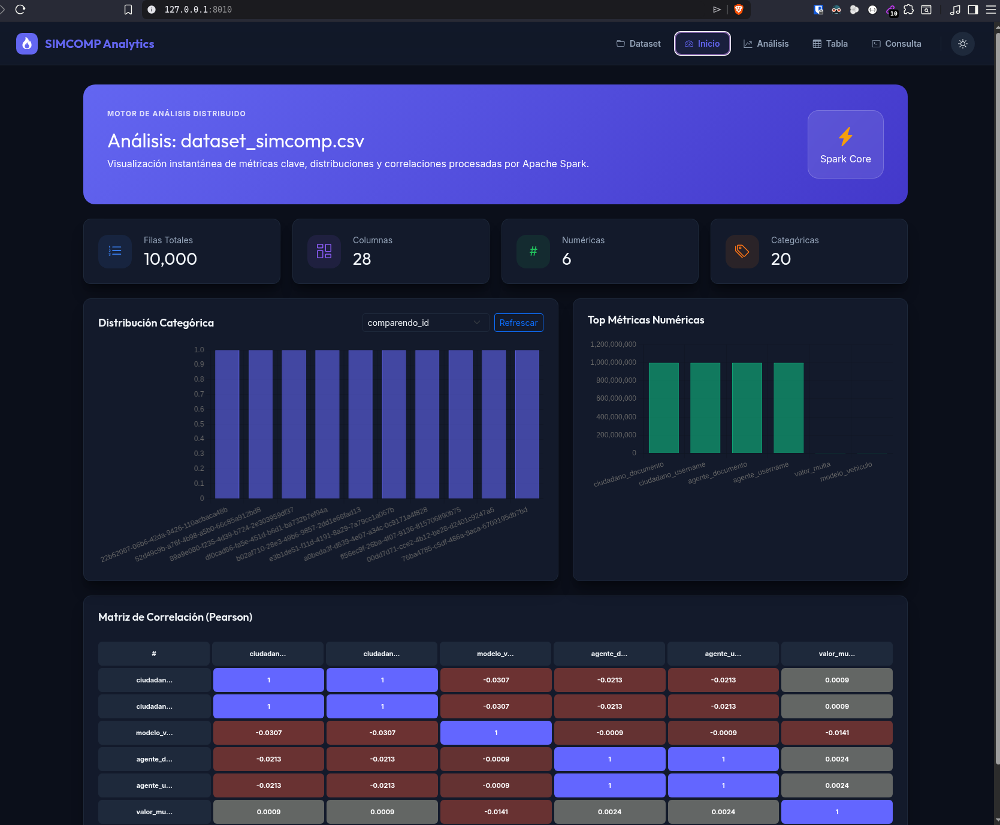
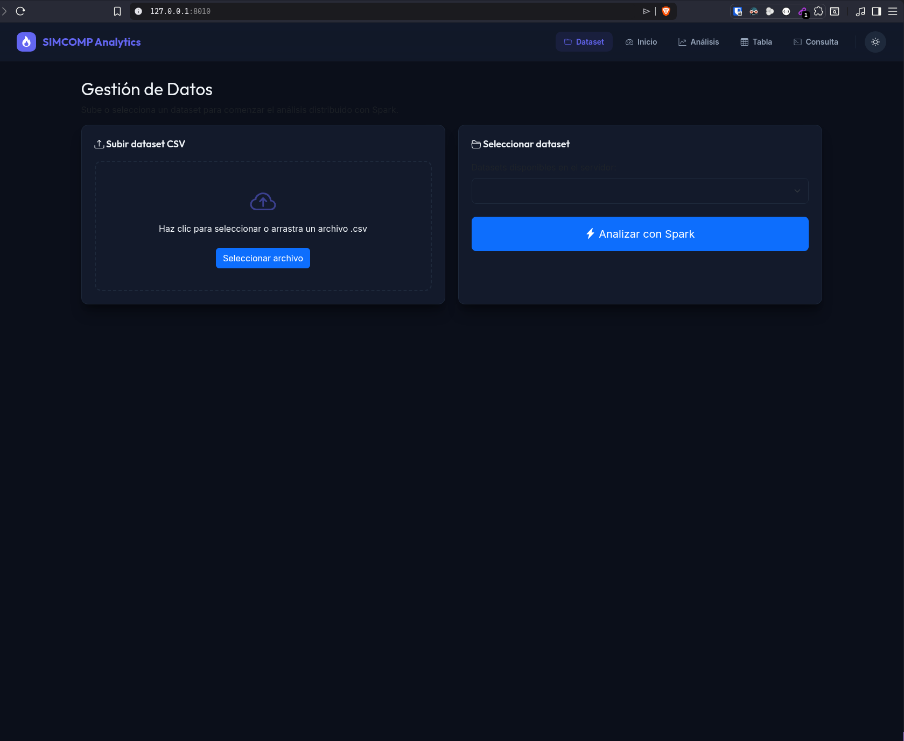
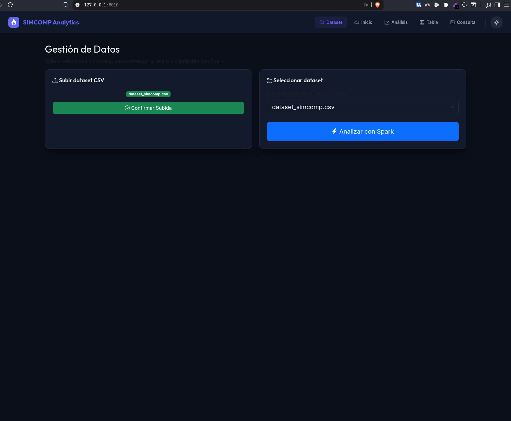
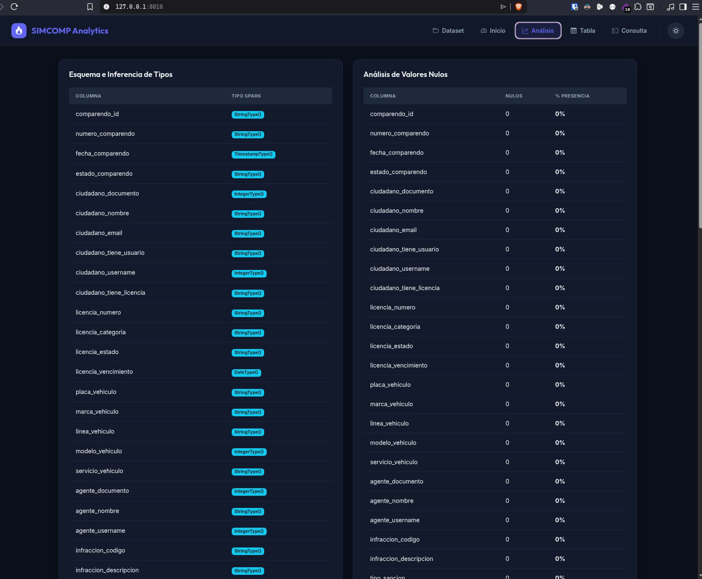
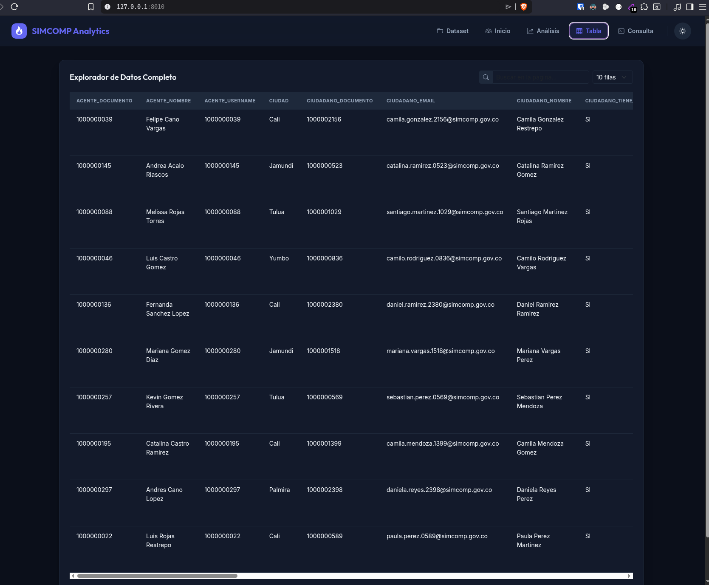
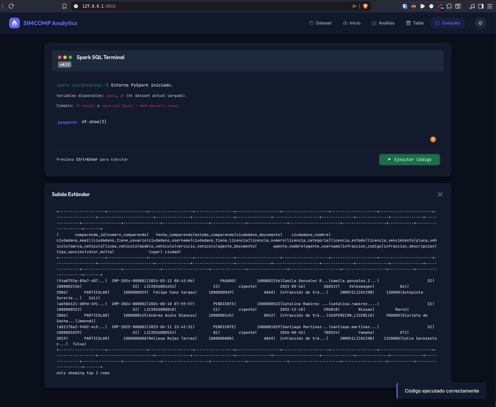

# SIMCOMP Analytics Spark Service

Microservicio analítico para SIMCOMP usando Flask, PySpark y Chart.js.

Este servicio permite analizar un archivo CSV de comparendos y visualizar la información en un dashboard web, así como proporcionar una API REST para consumir resúmenes y métricas sobre los datos.

## 🛠️ Tecnologías Usadas

- **Python 3.x**: Lenguaje principal de desarrollo.
- **Flask**: Framework ligero para construir la API REST y servir el Dashboard.
- **Apache Spark & PySpark**: Motor de procesamiento de datos distribuidos utilizado para analizar grandes volúmenes de datos desde el CSV en tiempo real.
- **Pandas**: Utilizado para manipulación auxiliar de datos.
- **Chart.js**: Biblioteca de JavaScript para renderizar gráficos en el frontend.
- **Docker / Podman**: Herramientas de contenedorización para empaquetar y ejecutar la aplicación de forma aislada.

#  Imagenes
- Dashboard


- Data


- Upload


- Analytics


- Table


- Terminal



## ⚙️ Cómo Funciona

El servicio carga dinámicamente un dataset de comparendos en formato CSV usando PySpark, permitiendo realizar consultas de agregación a alta velocidad.

1. **Carga de Datos**: El archivo CSV base se ubica en el directorio `data/`. Cuando se inicia la aplicación, PySpark lee este archivo para crear un DataFrame en memoria.
2. **Procesamiento Analítico**: A través de las rutas expuestas por Flask, el servicio de PySpark realiza agrupaciones, conteos y cálculos estadísticos (ej. comparendos por ciudad, valor de multas, etc.).
3. **API REST**: Los resultados procesados se exponen a través de endpoints en formato JSON.
4. **Visualización**: El dashboard (`/`) consume la API y renderiza las gráficas utilizando Chart.js para presentar información accionable.
5. **Modificación de Registros**: La aplicación permite la edición de los datos a través de peticiones PUT. Al modificar un registro, el archivo CSV se actualiza en el disco y las visualizaciones se refrescan.

## 📂 Estructura del Proyecto

```bash
analytics-spark-service/
├── app.py                     # Punto de entrada de la aplicación Flask
├── config.py                  # Configuraciones globales
├── data/
│   ├── uploads/               # Directorio de subida de datasets
│   └── dataset_simcomp.csv    # Dataset principal de comparendos
├── Dockerfile                 # Receta de construcción de la imagen de contenedor
├── requirements.txt           # Dependencias de Python
├── routes/
│   ├── api_routes.py          # Definición de endpoints de la API
│   └── dashboard_routes.py    # Rutas del frontend web
├── services/
│   ├── dataset_service.py     # Lógica de manipulación de archivos CSV
│   ├── profiling_service.py   # Lógica de análisis estadístico
│   └── spark_session.py       # Inicialización y configuración de Apache Spark
├── spark/
│   ├── log4j2.properties      # Configuración de logs de Spark
│   └── spark-defaults.conf    # Parámetros por defecto de Spark
├── static/
│   ├── css/
│   └── js/
└── templates/
    └── dashboard.html         # Interfaz visual
```

---

## 🚀 Cómo Usarlo

### 1. Dataset y Preparación

El archivo CSV debe estar ubicado en: `data/dataset_simcomp.csv`

**Columnas principales utilizadas:**
- `comparendo_id`, `numero_comparendo`, `fecha_comparendo`, `estado_comparendo`, `ciudad`, `infraccion_codigo`, `infraccion_descripcion`, `tipo_sancion`, `valor_multa`, `lugar`

Si no tienes el archivo, asegúrate de crear la carpeta y renombrarlo correctamente:
```bash
mkdir -p data
mv data/comparendos.csv data/dataset_simcomp.csv
```

---

### 2. Ejecutar Localmente

1. **Crear y activar entorno virtual**:
   ```bash
   python -m venv venv
   source venv/bin/activate
   ```
2. **Instalar dependencias**:
   ```bash
   pip install -r requirements.txt
   ```
3. **Ejecutar aplicación**:
   ```bash
   python app.py
   ```
4. **Abrir en el navegador**:
   Navega a http://localhost:8010

---

### 3. Ejecutar con Podman / Docker

1. **Construir imagen**:
   ```bash
   podman build -t simcomp-analytics-spark .
   # O usando docker:
   # docker build -t simcomp-analytics-spark .
   ```
2. **Ejecutar contenedor**:
   ```bash
   podman run --rm -p 8010:8010 simcomp-analytics-spark
   ```
3. **Abrir en el navegador**:
   Navega a http://localhost:8010

---

## 📡 Endpoints Disponibles

### Frontend
- **Dashboard**: `GET /`

### API REST
- **Resumen del dataset**: `GET /api/resumen`
- **Comparendos por ciudad**: `GET /api/comparendos-por-ciudad`
- **Comparendos por estado**: `GET /api/comparendos-por-estado`
- **Top infracciones**: `GET /api/top-infracciones`
- **Comparendos por mes**: `GET /api/comparendos-por-mes`
- **Valor de multas por ciudad**: `GET /api/valor-multas-por-ciudad`
- **Obtener comparendos**: `GET /api/comparendos?limit=20`

### Actualización de Datos (Edición)

Actualizar un comparendo: `PUT /api/comparendos/<comparendo_id>`

*Ejemplo:*
```bash
curl -X PUT http://localhost:8010/api/comparendos/ID_DEL_COMPARENDO \
  -H "Content-Type: application/json" \
  -d '{
    "estado_comparendo": "PAGADO",
    "ciudad": "Cali",
    "valor_multa": 580000,
    "lugar": "Centro"
  }'
```
> **Nota importante:** Para propósitos de este taller, la edición modifica directamente el archivo CSV. Al guardarse, PySpark vuelve a procesar los cambios.

---

## 💻 Validación Avanzada y Consola Spark

### API de Archivos y Profiling (Pruebas con cURL)

- **Subir cualquier CSV**:
  ```bash
  curl -X POST http://localhost:8010/api/datasets/upload -F "file=@data/dataset_simcomp.csv"
  ```
- **Resumen estadístico de un dataset**:
  ```bash
  curl http://localhost:8010/api/datasets/dataset_simcomp.csv/summary | jq
  ```
- **Graficar por categoría**:
  ```bash
  curl "http://localhost:8010/api/datasets/dataset_simcomp.csv/top-categories?column=ciudad" | jq
  ```

### Consola Interactiva PySpark en Contenedor

Puedes conectarte al contenedor en vivo y lanzar la consola de Spark para procesar datos:

1. Ingresa al contenedor:
   ```bash
   podman exec -it simcomp-analytics-spark bash
   ```
2. Ejecuta el shell interactivo de Python:
   ```bash
   pyspark
   ```
3. Ejecuta comandos de análisis en vivo:
   ```python
   # Cargar el archivo
   df = spark.read.option("header", True).csv("/app/data/uploads/dataset_simcomp.csv")
   
   # Mostrar estructura
   df.printSchema()
   
   # Top infracciones
   df.groupBy("infraccion_codigo").count().orderBy("count", ascending=False).show(10)
   ```