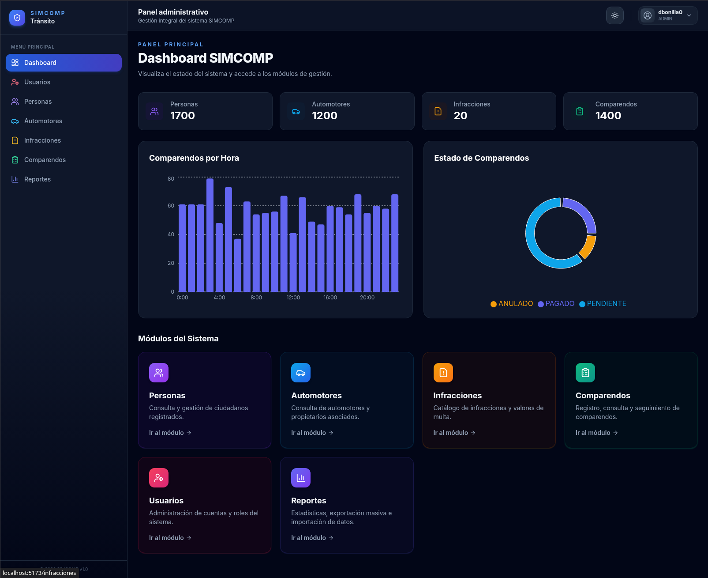
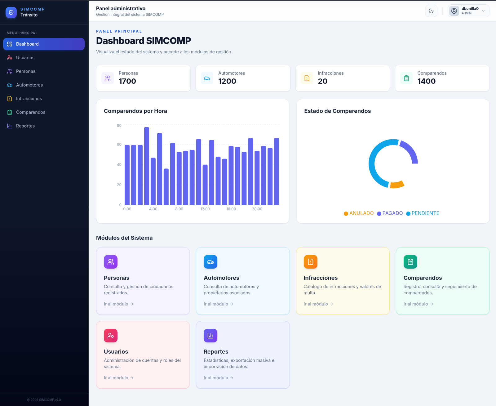
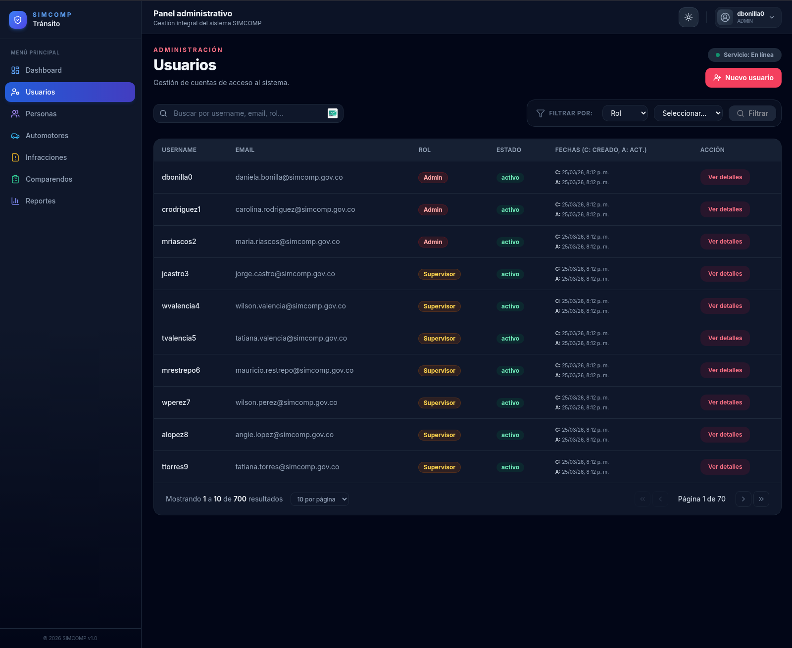
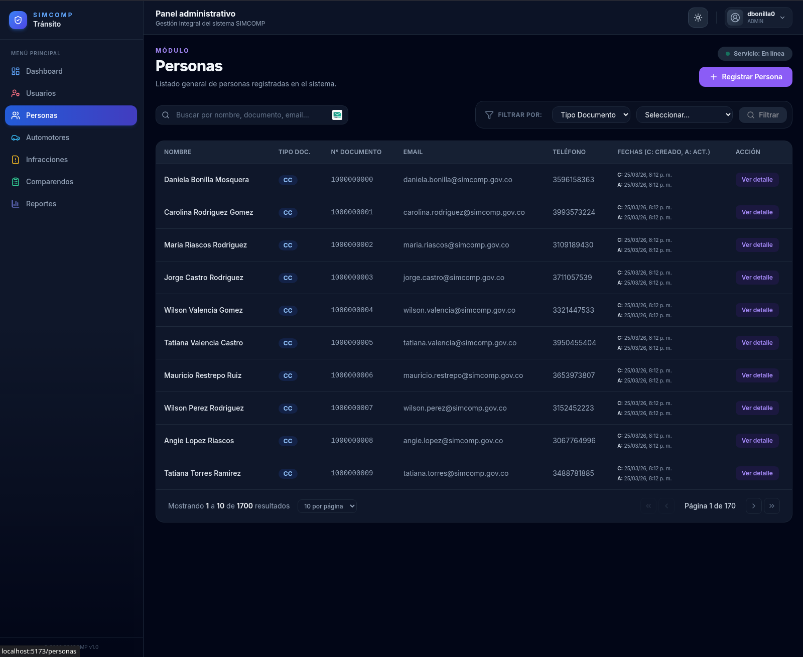
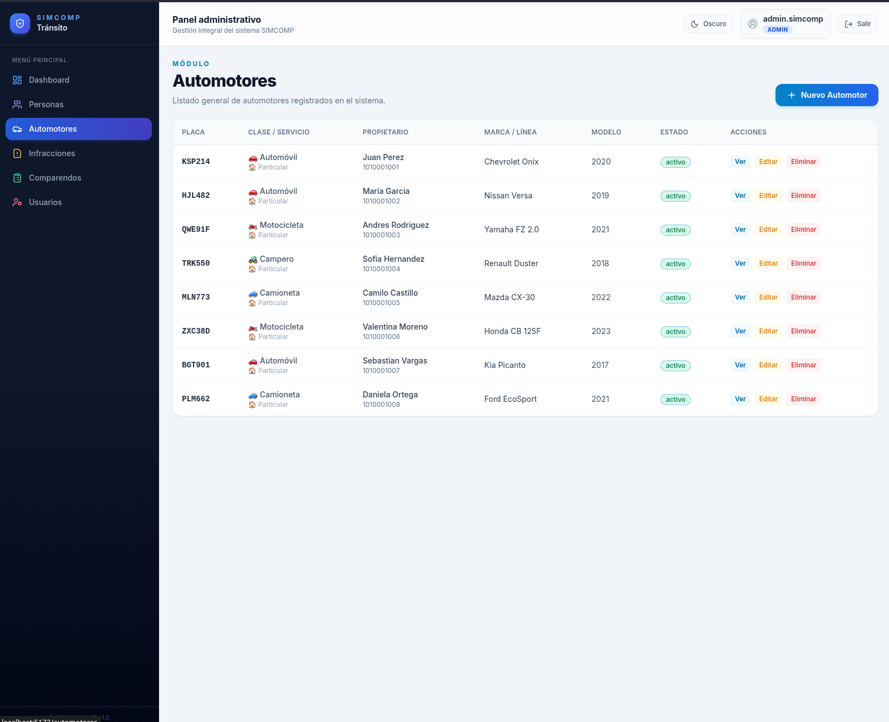
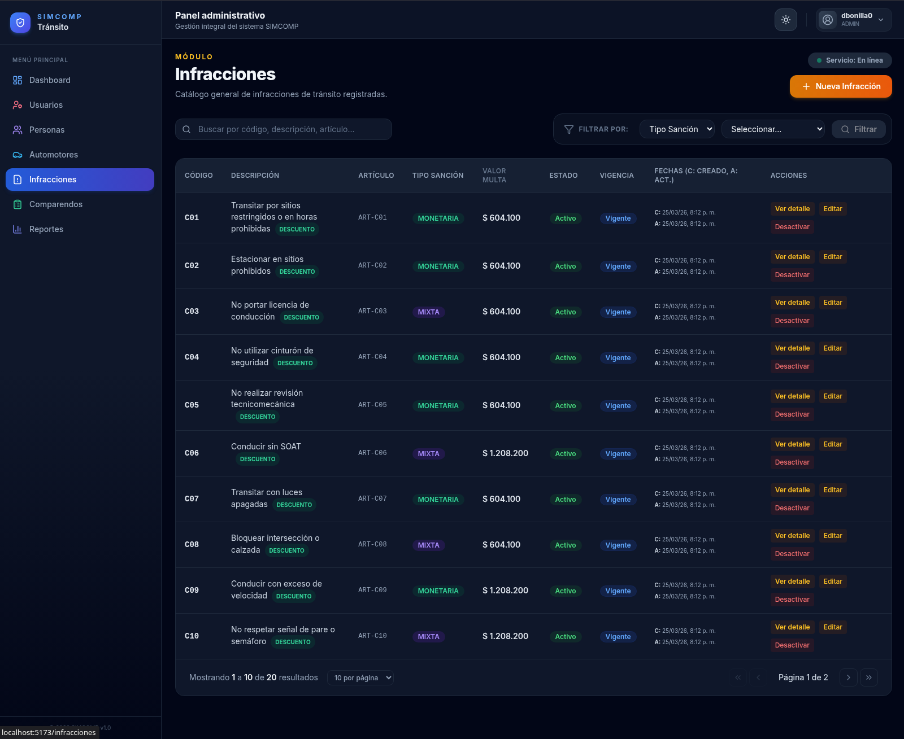
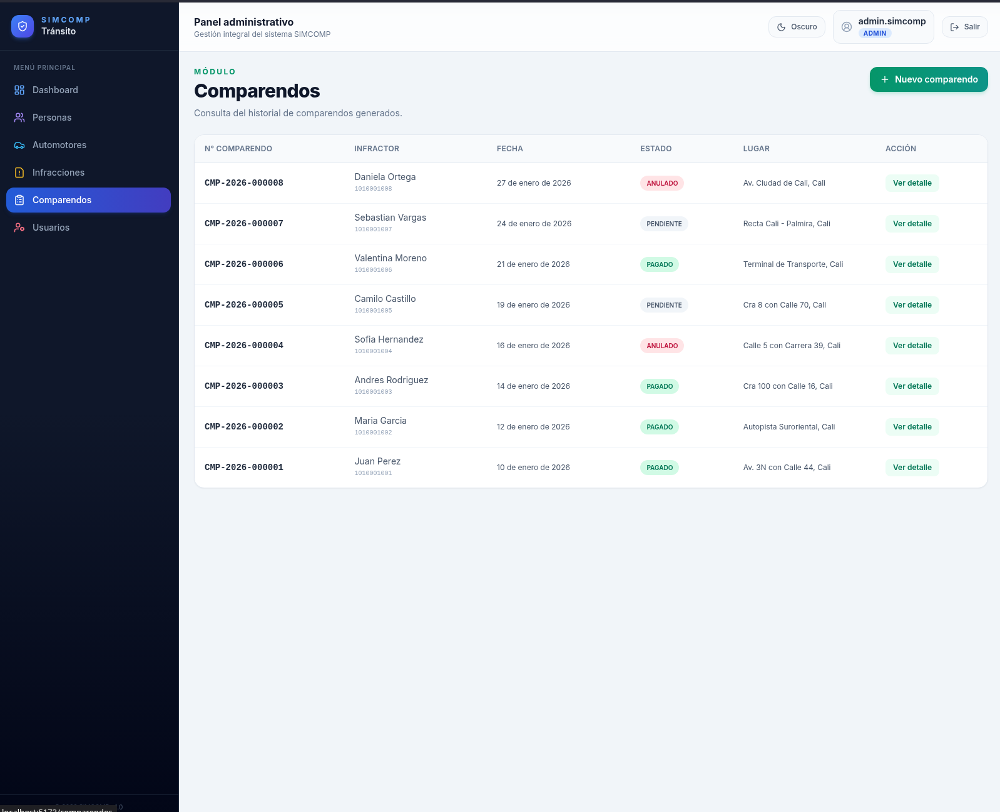
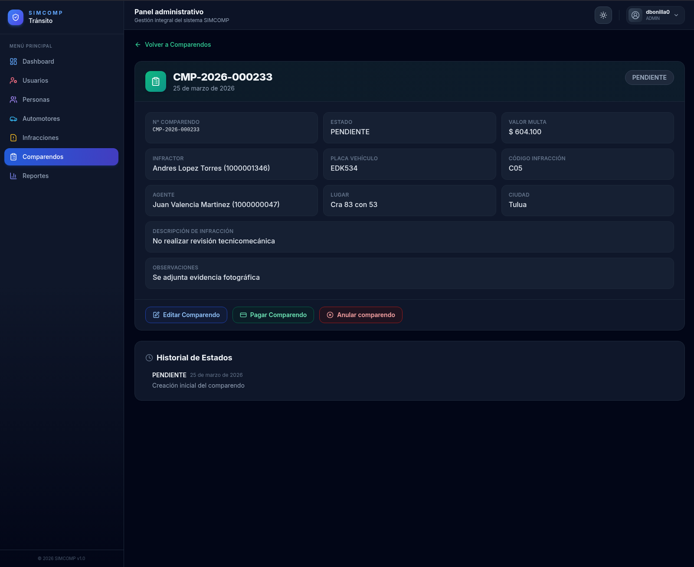
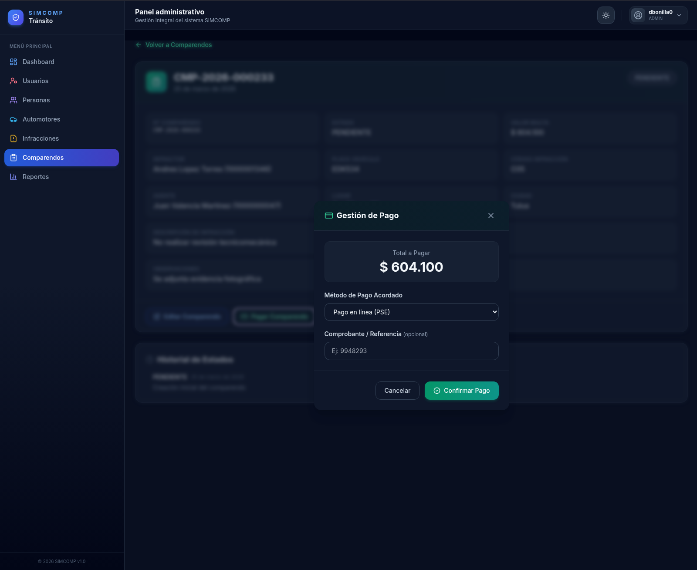
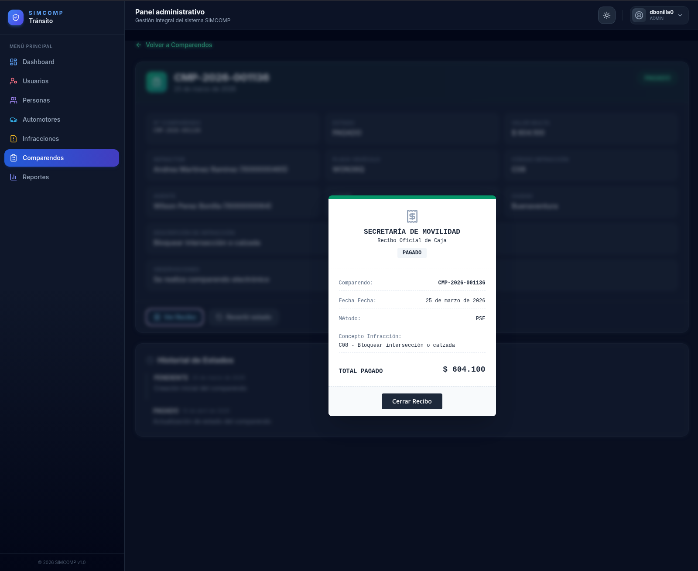

# SIMCOMP — Sistema de Comparendos de Tránsito

Sistema integral de gestión de comparendos de tránsito orientado a arquitecturas distribuidas y despliegues de alta disponibilidad utilizando Docker Swarm, Vagrant, HAProxy, Nginx, PostgreSQL, Prometheus, Grafana y un ecosistema de microservicios desacoplados.

El proyecto permite ejecutar el sistema en distintos entornos:

- Desarrollo local nativo
- Docker Compose / Podman
- Vagrant con aprovisionamiento clásico (Ansible)
- Cluster distribuido con Docker Swarm
- Swarm + Analytics Spark

Incluye balanceo de carga, monitoreo, observabilidad, despliegue automatizado, generación de secretos, gestión centralizada y pruebas de carga con JMeter.

---

# Imágenes Módulos SIMCOMP

- Login


- Dashboard dark


- Dashboard light


- Usuarios


- Personas


- Automotores


- Infracciones


- Comparendos


- Comparendo


- Pagar


- Recibo


- Reportes


---

# Guia Rapida: Comandos y Accesos

Esta sección resume cómo poner en marcha el sistema en diferentes ambientes y cómo acceder a cada uno.

| Ambiente | Comando de inicio | URL de acceso |
| :--- | :--- | :--- |
| **Local (Nativo)** | `pnpm dev` (en cada carpeta) | http://localhost:5173 |
| **Docker Compose** | `docker compose up -d` / `podman-compose up -d` | http://localhost:8080 |
| **Vagrant (Ansible)** | `./scripts/vagrant-manager.sh` (Opción 1) | http://simcomp.co |
| **Vagrant (Swarm)** | `./scripts/vagrant-manager.sh` (Opción 2/3) | http://simcomp.co |

## Enlaces de Acceso por Entorno

### Desarrollo Local / Docker Compose / Podman

| Servicio | URL | Credenciales |
| :--- | :--- | :--- |
| Frontend (HAProxy) | http://localhost:8080 | — |
| Dashboard Analytics | http://localhost:8010 | — |
| HAProxy Stats | http://localhost:8404/stats | admin / Admin123* |
| Grafana | http://localhost:3000 | admin / admin |
| Prometheus | http://localhost:9090 | — |
| cAdvisor | http://localhost:8081 | — |
| Swagger Auth | http://localhost:8001/api/docs | — |
| Swagger Personas | http://localhost:8002/api/docs | — |
| Swagger Automotores | http://localhost:8003/api/docs | — |
| Swagger Infracciones | http://localhost:8004/api/docs | — |
| Swagger Comparendos | http://localhost:8005/api/docs | — |
| Swagger Reportes | http://localhost:8006/api/docs | — |

### Entorno Vagrant / Swarm (192.168.100.x)

| Servicio | URL | Credenciales |
| :--- | :--- | :--- |
| Frontend Principal | http://simcomp.co | — |
| Dashboard Analytics | http://simcomp.co:8010 | — |
| HAProxy Stats | http://simcomp.co:8404/stats | admin / Admin123* |
| Grafana | http://simcomp.co:3000 | admin / admin |
| Prometheus | http://simcomp.co:9090 | — |
| Spark UI | http://simcomp.co:4040 | Solo durante ejecución de jobs |
| cAdvisor (Manager) | http://simcomp.co:8080 | — |
| Swagger Auth | http://192.168.100.3:8001/api/docs | — |
| Swagger Personas | http://192.168.100.3:8002/api/docs | — |
| Swagger Automotores | http://192.168.100.3:8003/api/docs | — |
| Swagger Infracciones | http://192.168.100.3:8004/api/docs | — |
| Swagger Comparendos | http://192.168.100.3:8005/api/docs | — |
| Swagger Reportes | http://192.168.100.3:8006/api/docs | — |

---

# Requisitos Previos

### Windows
- Docker Desktop
- Vagrant
- VirtualBox
- PowerShell 5+ o PowerShell Core
- Git

### Linux
- Docker o Podman
- Vagrant
- VirtualBox
- Bash
- Git

---

# Inicio del Proyecto — Gestor Centralizado

El proyecto incluye un gestor centralizado que automatiza la configuración del entorno, generación de secretos, despliegue de infraestructura y administración del cluster.

### Linux

```bash
chmod +x simcomp-manager.sh
./simcomp-manager.sh
```

> Dentro del menú, puedes usar la **Opción 9** para aplicar permisos automáticamente a todos los demás scripts del proyecto.

### Windows (PowerShell como Administrador)

```powershell
Set-ExecutionPolicy -ExecutionPolicy Bypass -Scope Process
.\simcomp-manager.ps1
```

> Si los scripts están bloqueados por haber sido descargados, usa la **Opción 9** dentro del menú para desbloquearlos automáticamente.

## Funciones del Gestor Central

El gestor abstrae toda la complejidad técnica del proyecto. Se recomienda usarlo para todas las operaciones:

1. **Configuración**: Generación de `.env` y Secretos Docker.
2. **DNS**: Configuración automática del archivo `hosts`.
3. **Infraestructura**: Despliegue y gestión de Vagrant/Swarm.
4. **Build**: Compilación masiva de imágenes Docker.
5. **JMeter**: Ejecución de pruebas de carga y reportes HTML.
6. **Git**: Sincronización automática de ramas de microservicios.
7. **Dependencias**: Instalación masiva de paquetes Node.js (`pnpm`/`npm`).

---

# Flujo Recomendado de Configuración

## Paso 1 — Configurar Entorno (.env y Secretos)

Al iniciar el gestor, seleccionar:

```
[1] Configurar Entorno (.env y Secretos)
```

Esta opción genera automáticamente:

- `.env`
- `.env.local`
- `.env.vagrant`
- `.env.swarm`
- Docker Secrets

Esta configuración es **obligatoria** para el correcto funcionamiento de los microservicios independientemente del entorno utilizado.

## Paso 2 — Configurar DNS Local

Después de generar los entornos, configurar el DNS local seleccionando:

```
[2] Configurar DNS Local (hosts)
```

Esto modificará automáticamente el archivo `hosts` del sistema operativo para permitir acceder al proyecto mediante `http://simcomp.co`.

## Paso 3 — Gestionar Infraestructura

Seleccionar:

```
[3] Gestionar Infraestructura (Vagrant/Swarm)
```

El gestor mostrará varios modos de despliegue:

```
1) Paso a paso
2) Semi automático
3) Automático completo
```

> **Recomendación**: Para evitar errores durante la inicialización de las máquinas virtuales, se recomienda utilizar `1) Paso a paso`.

---

# Selección de Entorno

Después de ingresar al modo paso a paso, aparecerán los entornos disponibles:

| Opción | Entorno | Descripción |
| :--- | :--- | :--- |
| 1 | Native | Máquinas virtuales clásicas aprovisionadas con Ansible |
| 2 | Docker Swarm | Cluster distribuido utilizando Docker Swarm |
| 3 | Swarm + Spark | Igual al entorno Swarm, pero con Analytics y cluster Spark |

> **Recomendación**: Para ejecutar el proyecto completo se recomienda `3) Swarm + Spark`. Ademas le pedira si es usuario Linux o Windows

## Configuración de Red

Posteriormente el gestor solicitará el modo de red:

```
1) Local
2) Distribuido
```

> **Recomendación**: Si todo se ejecutará en un único computador, utilizar `1) Local`.

---

# Provisionamiento de Máquinas

Una vez iniciado el proceso:

- Presionar ENTER cuando el gestor lo solicite.
- Esperar a que cada etapa finalice completamente.

El primer despliegue puede tardar entre 20 a 30 minutos dependiendo del hardware y velocidad de internet.
Ademas cuando inicie el deploy puede tardar entre 8 a 10 minutos que todos los microservicios con sus replicas funcionen correctamente, puede revisar la pagina de haproxy para mas informacion del estado de los microservicios.

---

# Arquitectura del Cluster (Docker Swarm)

El sistema opera sobre un cluster de 3 nodos virtualizados para garantizar resiliencia y balanceo de carga:

| Nodo | IP | Rol | Descripción |
| :--- | :--- | :--- | :--- |
| **managerDocker** | `192.168.100.2` | Manager | Orquestador, Nginx Gateway y HAProxy |
| **workerDocker1** | `192.168.100.3` | Worker | Microservicios y Bases de Datos |
| **workerDocker2** | `192.168.100.4` | Worker | Microservicios y Bases de Datos |

## Componentes del Stack

1. **HAProxy**: Balanceador de carga de entrada (Puerto 80) y panel de estadísticas (Puerto 8404). Configurado en modo `dnsrr` para máxima eficiencia.
2. **Nginx API Gateway**: Proxy inverso con validación de JWT para proteger microservicios.
3. **Frontend**: Aplicación React (Vite) servida por Nginx.
4. **7 Microservicios**: Auth, Personas, Automotores, Infracciones, Comparendos, Reportes y Analytics Spark.
5. **PostgreSQL 16**: 5 bases de datos independientes con persistencia en volúmenes.
6. **Prometheus**: Recolección de métricas de contenedores y servicios.
7. **Grafana**: Visualización de métricas mediante dashboards preconfigurados.
8. **cAdvisor**: Exportador de métricas de contenedores (corre como servicio global en todos los nodos).

---

# Estructura del Repositorio

### Frontend
- [Frontend (React + Vite)](./frontend)

### Backend (Node.js + Express)
- [Auth Service](./backend/ms-auth-service)
- [Personas Service](./backend/ms-personas)
- [Automotores Service](./backend/ms-automotores)
- [Infracciones Service](./backend/ms-infracciones)
- [Comparendos Service](./backend/ms-comparendos)
- [Reportes Service](./backend/ms-reportes)

### Analytics y Big Data
- [Analytics Spark Service (PySpark + Flask)](./analytics-spark-service)

### Infraestructura
- [Provisioning Docker (Swarm, HAProxy, Nginx)](./provisioning_docker)

---

# Modos de Despliegue y Archivos de Configuración

**Se han eliminado todos los valores por defecto (hardcoded) del código fuente para garantizar la seguridad.** La configuración debe proveerse explícitamente mediante archivos `.env` o Docker Secrets:

| Modo | Archivo | Descripción |
| :--- | :--- | :--- |
| **Local Nativo** | `.env.local` | Ejecución directa en el PC anfitrión (localhost) |
| **Vagrant Nativo** | `.env.vagrant` | Despliegue en VMs mediante `Vagrantfile_native` y Ansible |
| **Docker Local** | `.env.docker` | Uso de `docker-compose.local.yml` con imágenes de Docker Hub |
| **Docker Swarm** | `.env.swarm` | Cluster distribuido en Vagrant. Usa Docker Secrets para datos sensibles |

---

# Comandos de Inicio por Ambiente

## 1. Desarrollo Local Nativo

```bash
# Iniciar bases de datos (requiere Docker/Podman)
docker compose up -d db-auth db-personas db-automotores db-infracciones db-comparendos
# o con podman
podman-compose up -d db-auth db-personas db-automotores db-infracciones db-comparendos

# Backend (en cada servicio)
cd backend/ms-auth-service && pnpm dev

# Frontend
cd frontend && pnpm dev
```

## 2. Docker Compose / Podman (Completo)

```bash
# Iniciar todo el ecosistema
docker compose -f docker-compose.local.yml up --build -d
# o con Podman
podman compose -f docker-compose.local.yml up --build -d

# Ver logs
docker compose -f docker-compose.local.yml logs -f

# Detener
docker compose -f docker-compose.local.yml down
```

## 3. Vagrant y Docker Swarm

```bash
# 1. Inicializar infraestructura
./scripts/vagrant-manager.sh  # Seguir menú interactivo

# 2. Desplegar el stack (si no se hizo automáticamente)
vagrant provision managerDocker --provision-with deploy-stack

# 3. Verificar estado
vagrant ssh managerDocker -c "docker stack services simcomp"
```

---

# Guia de Despliegue en Swarm (Paso a Paso)

## 1. Preparar las VMs e Infraestructura

```bash
vagrant up
```

Este comando automatiza la instalación de Docker, la configuración de `/etc/hosts` y la inicialización del cluster Swarm (Manager + 2 Workers).

## 2. Verificar el Cluster

```bash
vagrant ssh managerDocker -c "docker node ls"
```

## 3. Desplegar el Stack

```bash
vagrant provision managerDocker --provision-with deploy-stack
```

O manualmente desde el Manager:

```bash
vagrant ssh managerDocker
cd /vagrant/provisioning_docker
docker stack deploy -c stack.yml simcomp
```

## 4. Monitoreo Inicial

Verifica que todos los servicios estén subiendo (puede tomar 1–2 minutos la primera vez):

```bash
vagrant ssh managerDocker -c "docker stack services simcomp"
```

## 5. Acceso al Sistema y DNS

- **Panel de Control**: Ejecuta `./simcomp-manager.sh` (Linux) o `.\simcomp-manager.ps1` (Windows) y selecciona la **Opción 2**.
- **Manual (Linux)**: `./scripts/setup-hosts.sh`
- **Manual (Windows)**: `.\scripts\setup-hosts.ps1`

## 6. Configurar las Conexiones en DBeaver

En DBeaver, crea una nueva conexión seleccionando el driver de **PostgreSQL**. En la configuración general, utiliza los siguientes parámetros según la base de datos a la que desees acceder:

| Base de Datos | Host / IP | Puerto | Nombre de BD | Usuario | Contraseña (por defecto en `.env`) |
| :--- | :--- | :--- | :--- | :--- | :--- |
| **Auth** | `192.168.100.2` | `5432` | `auth_db` | `auth_user` | `auth_pass` |
| **Personas** | `192.168.100.2` | `5433` | `personas_db` | `personas_user` | `personas_pass` |
| **Automotores** | `192.168.100.2` | `5434` | `automotores_db` | `automotores_user` | `automotores_pass` |
| **Infracciones** | `192.168.100.2` | `5435` | `infracciones_db` | `infracciones_user` | `infracciones_pass` |
| **Comparendos** | `192.168.100.2` | `5436` | `comparendos_db` | `comparendos_user` | `comparendos_pass` |

> [!NOTE]
> Para que el acceso externo a los puertos `5432`-`5436` funcione correctamente, asegúrate de haber publicado dichos puertos en la definición de cada servicio de base de datos dentro del archivo `provisioning_docker/stack.yml`.

> [!IMPORTANT]
> **Sobre las contraseñas:** En el clúster Swarm, las contraseñas se inyectan mediante los secretos ubicados en `provisioning_docker/secrets/*.txt`. Si generaste los secretos con `./scripts/build-secrets.sh`, estos toman automáticamente los valores definidos en el archivo `.env` de la raíz de tu proyecto (mostrados en la tabla superior). Si personalizaste las claves en tu `.env`, asegúrate de usar esas mismas en DBeaver.

---

# Verificación y Pruebas (Docker / Podman)

Una vez que el sistema esté arriba, puedes realizar las siguientes verificaciones:

## Acceso a la Aplicación

- **URL**: http://localhost:8080
- Deberías ver la pantalla de login.

## Health Check de Microservicios

| Servicio | Endpoint |
| :--- | :--- |
| Auth | http://localhost:8001/api/health |
| Personas | http://localhost:8002/api/health |
| Automotores | http://localhost:8003/api/health |
| Infracciones | http://localhost:8004/api/health |
| Comparendos | http://localhost:8005/api/health |
| Reportes | http://localhost:8006/api/health |

## Analytics Spark

- **Dashboard**: http://localhost:8010
- **Spark UI**: http://localhost:4040 (Solo visible mientras se procesa un Job)

## Monitoreo del Balanceador (HAProxy)

- **URL**: http://localhost:8404/stats
- **Credenciales**: `admin` / `Admin123*`
- Todos los backends deben aparecer en verde (UP).

---

# Endpoints de Prueba (con JWT)

| Endpoint | Auth | Descripción |
| :--- | :--- | :--- |
| http://simcomp.co/api/auth/login | — | Login de usuario |
| http://simcomp.co/api/personas | JWT | Personas via HAProxy |
| http://simcomp.co/api/automotores | JWT | Automotores via HAProxy |
| http://simcomp.co/api/infracciones | JWT | Infracciones via HAProxy |
| http://simcomp.co/api/comparendos | JWT | Comparendos via HAProxy |
| http://simcomp.co/api/reportes/estadisticas | JWT | Reportes via HAProxy |
| http://simcomp.co:3000/ | admin | Grafana Monitoring Dashboards |
| http://simcomp.co:9090/ | — | Prometheus Metrics Dashboard |
| http://simcomp.co:8404/stats | admin | HAProxy Load Balancing Stats |
| http://simcomp.co:8010/ | — | Dashboard de Analytics Spark |
| http://192.168.100.3:8001/api/docs | — | Swagger auth-service |
| http://192.168.100.3:8002/api/docs | — | Swagger personas-service |
| http://192.168.100.3:8003/api/docs | — | Swagger automotores-service |
| http://192.168.100.3:8004/api/docs | — | Swagger infracciones-service |
| http://192.168.100.3:8005/api/docs | — | Swagger comparendos-service |
| http://192.168.100.3:8006/api/docs | — | Swagger reportes-service |

---

# Usuarios de Prueba

| Rol | Usuario | Contraseña | Descripción |
| :--- | :--- | :--- | :--- |
| Administrador | maria.bonilla.0001@simcomp.gov.co | Admin123* | Todos los permisos |
| Agente | ana.ruiz.0006@simcomp.gov.co | Agente123* | Creador de comparendos |
| Supervisor | natalia.ortiz.0326@simcomp.gov.co | Super123* | Revision de comparendos |
| Ciudadano | sebastian.gomez.0533@simcomp.gov.co | 1000000533 | Persona natural |

---

# Operaciones y Gestión del Stack (Docker Swarm)

## Monitoreo y Estado

| Acción | Comando (desde el Manager) |
| :--- | :--- |
| Ver servicios del stack | `docker stack services simcomp` |
| Ver tareas de un servicio | `docker service ps simcomp_frontend` |
| Estado de los nodos | `docker node ls` |
| Uso de recursos | `docker stats` |
| Grafana Dashboard | http://simcomp.co:3000 |
| Prometheus Targets | http://simcomp.co:9090/targets |
| HAProxy Metrics | http://simcomp.co:8404/stats |

## Escalamiento

Puedes aumentar o disminuir las réplicas de cualquier microservicio en caliente:

```bash
# Escalar el frontend a 5 réplicas
docker service scale simcomp_frontend=5

# O usando el script de utilidad
./provisioning_docker/scripts/scale-service.sh simcomp_ms-auth-service 10
```

## Gestión de Logs

```bash
# Ver logs en tiempo real de un servicio
docker service logs -f simcomp_ms-auth-service

# Ver logs de HAProxy
docker service logs -f simcomp_haproxy
```

## Detener y Reiniciar

| Acción | Comando |
| :--- | :--- |
| Eliminar el stack | `docker stack rm simcomp` |
| Reiniciar un servicio | `docker service update --force simcomp_ms-reportes` |
| Limpiar volúmenes | `docker volume prune` (Cuidado: borra bases de datos) |

## Acceso a los Nodos del Cluster

```bash
# Entrar al Manager (HAProxy y despliegue)
vagrant ssh managerDocker

# Entrar al Worker 1 (microservicios)
vagrant ssh workerDocker1

# Entrar al Worker 2 (bases de datos)
vagrant ssh workerDocker2
```

---

# Gestion de Secretos (Modo Swarm)

En el despliegue de Swarm, las credenciales de base de datos y llaves JWT **no se almacenan en archivos `.env`**. El sistema las lee desde `/run/secrets/` inyectados por el orquestador.

Debes crear los siguientes secretos manualmente una única vez:

```bash
# Ejemplo para ms-auth-service
echo "admin123" | docker secret create auth_db_password -
# Repetir para cada servicio (personas_db_password, etc.)

# Secreto compartido para JWT
echo "tu_llave_secreta_super_segura" | docker secret create jwt_secret -
```

> [!IMPORTANT]
> Si falta alguno de estos secretos o variables de entorno, los microservicios no iniciarán. Esto es intencional para evitar el uso de configuraciones inseguras por defecto.

---

# Generacion Automatica de Entornos (.env)

Scripts que generan automáticamente todos los archivos `.env`, `.env.local`, `.env.vagrant` y `.env.swarm` para cada microservicio a partir de sus plantillas (`.env.example`).

### Linux

```bash
chmod +x scripts/build-envs.sh
./scripts/build-envs.sh
```

### Windows (PowerShell)

```powershell
.\scripts\build-envs.ps1
```

> [!TIP]
> Ejecuta este script cada vez que clones el repositorio o cuando haya cambios en las plantillas `.env.example`.

---

# Generacion de Secretos (Swarm)

Para el despliegue en Docker Swarm, los secretos se extraen automáticamente de tus archivos `.env.swarm`.

### Linux

```bash
chmod +x scripts/build-secrets.sh
./scripts/build-secrets.sh
```

### Windows (PowerShell)

```powershell
.\scripts\build-secrets.ps1
```

> [!TIP]
> Ejecuta este script antes de realizar el despliegue del stack (`deploy-stack`) en el cluster.

---

# Gestion de Imagenes en Docker Hub

El proyecto incluye scripts de automatización para construir y distribuir imágenes de todos los microservicios y el frontend.

- **Detección automática**: Identifica si estás usando `docker` o `podman`.
- **Gestión de contexto**: Construye cada imagen desde su carpeta raíz correspondiente.
- **Etiquetado automático**: Sube las imágenes con el prefijo de usuario y versión especificados.

### Linux

```bash
chmod +x scripts/build-and-push-dockerhub.sh
export DOCKERHUB_USER="tu_usuario"
export VERSION="v1.0.0"
./scripts/build-and-push-dockerhub.sh
```

### Windows (PowerShell)

```powershell
$env:DOCKERHUB_USER="tu_usuario"
$env:VERSION="v1.0.0"
.\scripts\build-and-push-dockerhub.ps1
```

> [!TIP]
> Si PowerShell bloquea la ejecución de scripts, habilítala temporalmente con:
> `Set-ExecutionPolicy -Scope Process Bypass`

### Construccion Individual

Si deseas construir solo un servicio específico:

- **Linux**: `./scripts/build-and-push-dockerhub.sh ms-auth-service`
- **Windows**: `.\scripts\build-and-push-dockerhub.ps1 -Only ms-auth-service`

---

# Configuracion de DNS Local (Manual)

Si no usas el gestor automatizado, puedes configurar el DNS manualmente:

### Linux (Ubuntu / Debian / Arch)

```bash
sudo nano /etc/hosts
```

Agrega al final:

```
192.168.100.2  simcomp.co www.simcomp.co api.simcomp.co stats.simcomp.co monitor.simcomp.co spark.simcomp.co
```

### Windows 10 / 11

1. Abre el Bloc de notas como Administrador.
2. Abre el archivo: `C:\Windows\System32\drivers\etc\hosts`
3. Agrega al final:

```
192.168.100.2  simcomp.co www.simcomp.co api.simcomp.co stats.simcomp.co monitor.simcomp.co spark.simcomp.co
```

---

# Pruebas de Carga (JMeter)

Se recomienda ejecutar JMeter desde tu PC local apuntando a `http://simcomp.co`. Los archivos `.jmx` se encuentran en la carpeta `jmeter/`. Para guías detalladas y descripción de métricas consulta:

**[Guia de Pruebas JMeter](./jmeter/README.md)**

## Archivos de Prueba Disponibles

| Archivo | Descripción |
| :--- | :--- |
| `simcomp-login.jmx` | Prueba el endpoint de autenticación y extrae el token JWT |
| `simcomp-comparendos.jmx` | Realiza login y consultas al microservicio de comparendos |
| `simcomp-workflow-completo.jmx` | Simula un flujo real (Login → Personas → Vehículos → Comparendos) |
| `simcomp-estres-frontend.jmx` | Prueba masiva de carga al servidor web de la aplicación |

## Ejecución por Línea de Comandos

```bash
jmeter -n -t jmeter/simcomp-workflow-completo.jmx -l results.jtl
```

Durante la prueba, observa en HAProxy Stats (http://simcomp.co:8404/stats) el balanceo entre los contenedores.

---

# Solución de Problemas

## Errores de Timeout / SSH durante el Provisionamiento

Si durante el aprovisionamiento aparece:

```
Timed out / SSH timeout / Connection timeout
```

Ingresar nuevamente al gestor en `[3] Gestionar Infraestructura`, luego:

```
5) Apagar máquinas
8) Limpiar todo
```

Y volver a iniciar el despliegue.

## Encendido Manual de Máquinas

Si el problema persiste, iniciar las máquinas una por una:

```bash
vagrant up managerDocker --no-provision
vagrant up workerDocker1 --no-provision
vagrant up workerDocker2 --no-provision
```

Esperar que cada máquina inicie correctamente antes de continuar con la siguiente.

## Recuperar una Máquina con Error

```bash
vagrant halt workerDocker2
vagrant destroy -f workerDocker2
vagrant up workerDocker2 --no-provision
```

## Provisionamiento Manual (tras encendido manual)

```bash
vagrant provision managerDocker
vagrant provision workerDocker1
vagrant provision workerDocker2
```

## Servicios en Shutdown o Complete (tras reinicio de VMs)

```bash
vagrant ssh managerDocker -c "docker service update --force simcomp_haproxy"
vagrant ssh managerDocker -c "docker service update --force simcomp_frontend"
```

También puedes usar la opción **REPARAR** en `./scripts/vagrant-manager.sh`.

## Error "No such image" en los Workers

```bash
vagrant ssh workerDocker1 -c "docker pull deytonro/simcomp-auth-service:latest"
```

## Stack no Termina de Subir (Servicios en 0/1)

Verifica los logs del servicio que falla:

```bash
vagrant ssh managerDocker -c "docker service logs -f simcomp_ms-auth-service"
```

## Gateway devuelve 401 en todas las rutas (Entorno Nativo)

```bash
vagrant ssh srv-simcomp-api
pm2 logs auth-service --lines 30
pm2 restart auth-service
curl http://localhost:8001/api/health
```

## Nginx 502 Bad Gateway (Entorno Nativo)

```bash
vagrant ssh srv-simcomp-web
sudo tail -f /var/log/nginx/simcomp-error.log
sudo systemctl restart nginx
```

## DNS no resuelve (Entorno Nativo)

```bash
vagrant ssh srv-simcomp-dns
sudo systemctl status named
sudo systemctl restart named
dig @127.0.0.1 simcomp.co
```

## Reset Completo

```bash
vagrant destroy -f
cd frontend && npm run build && cd ..
vagrant up
```

---

# Comandos Vagrant — Entorno Nativo / Ansible

> Estos comandos aplican solo si usas el `Vagrantfile_native`.

```bash
vagrant status
vagrant ssh srv-simcomp-dns
vagrant ssh srv-simcomp-api
vagrant ssh srv-simcomp-web
vagrant provision srv-simcomp-api          # re-aprovisionar tras cambios en backend
vagrant provision srv-simcomp-web          # re-aprovisionar tras nuevo build frontend
vagrant reload --provision srv-simcomp-api
vagrant halt
vagrant up --no-provision
vagrant destroy -f && vagrant up
```

## PM2 en srv-simcomp-api

```bash
vagrant ssh srv-simcomp-api

pm2 list
pm2 logs auth-service
pm2 logs comparendos-service
pm2 restart auth-service
pm2 reload all                               # recarga sin downtime
tail -f /var/log/simcomp/auth-error.log
tail -f /var/log/simcomp/comparendos-error.log
```

---

# Auditoría y Mejoras de Producción

Tras una auditoría técnica profunda, el sistema ha sido elevado a estándares de producción con las siguientes mejoras:

## 1. Seguridad — Docker Secrets

Se eliminó el uso de variables de entorno en texto plano para datos sensibles. Las contraseñas de bases de datos y `JWT_SECRET` se gestionan mediante `docker secret`. Los secretos viajan cifrados y solo se montan en memoria (`/run/secrets/`) dentro de los contenedores autorizados.

## 2. Alta Disponibilidad Real

Se optimizaron las políticas de despliegue en `stack.yml` eliminando restricciones fijas a nodos específicos con `placement.preferences`, lo que garantiza distribución equitativa de réplicas y resiliencia ante fallos de nodos.

## 3. Observabilidad — Descubrimiento Dinámico (DNS SD)

Prometheus utiliza `dns_sd_configs` para descubrir automáticamente todas las réplicas individuales de un servicio. Los microservicios integran `prom-client` para exponer métricas nativas.

## 4. Rendimiento y Optimización (High Concurrency)

Para soportar cargas superiores a 500 peticiones en ráfagas de 10 segundos se aplicaron las siguientes optimizaciones:

**HAProxy Tuning:**
- `maxconn` aumentado a 20,000.
- Algoritmo `leastconn` para distribución de carga más inteligente.
- Compresión Gzip habilitada para reducir latencia de red.
- `http-server-close` para liberar descriptores de archivos rápidamente.

**Escalado de Microservicios:**
- Réplicas aumentadas en servicios críticos (`ms-auth` a 4 réplicas, `ms-personas` a 3).
- `NODE_ENV=production` forzado para desactivar logs innecesarios.

**Infraestructura Vagrant:**
- RAM incrementada (4 GB Manager, 5 GB Workers).
- Optimización de la red overlay de Docker Swarm.

## 5. Seguridad de Capa 7

ACLs en HAProxy bloquean el acceso externo a rutas `/internal/`, garantizando que la comunicación entre servicios sea estrictamente privada.

---

# Características de Datos

- **Borrado lógico (Soft Delete)**: El sistema implementa borrado lógico mediante el campo `deleted_at` en todas las entidades principales. Los registros no se eliminan físicamente de la base de datos.
- **Auditoría**: Todas las tablas incluyen campos `created_at` y `updated_at` gestionados automáticamente por Sequelize.

---

# Dataset Incluido

| Archivo | Registros |
| :--- | :--- |
| personas.csv | 1700 |
| usuarios.csv | 700 |
| licencias_conduccion.csv | 1411 |
| vehiculos.csv | 1200 |
| infracciones.csv | 20 |
| comparendos.csv | 1400 |
| historial_comparendos.csv | 1922 |

**Total tablas principales** (personas + usuarios + vehículos + infracciones + comparendos): **5020 registros**.

---

# Seguridad

- Docker Secrets
- JWT Authentication
- API Gateway con Nginx
- ACLs en HAProxy
- Segmentación interna de servicios
- Variables de entorno desacopladas por ambiente
- Sin credenciales hardcodeadas en el código fuente

---

# Observabilidad y Monitoreo

- Prometheus (recolección de métricas)
- Grafana (dashboards preconfigurados)
- cAdvisor (métricas de contenedores en todos los nodos)
- HAProxy Stats (estado del balanceador en tiempo real)
- Métricas nativas por microservicio (`prom-client`)

---

# Equipo de Desarrollo

- Deyton Riascos Ortiz
- Samuel Izquierdo Bonilla
- Mauricio Taborda Gongora

Universidad Autónoma de Occidente — Ingeniería de Datos e Inteligencia Artificial

---

*SIMCOMP — Docker Swarm · Vagrant · HAProxy · PostgreSQL · Grafana · Prometheus · Spark · Microservicios · Alta Disponibilidad · v1.3.0*